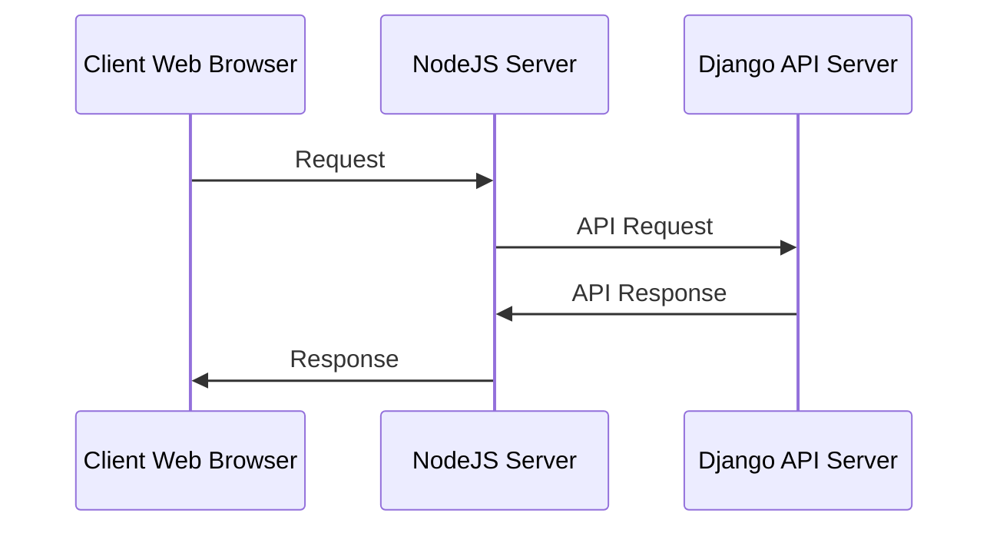

# Kannada Sentiment Analysis


A **Lexicon** and **Machine Learning** based analysis for the given Kannada text or file with graph visualization powered by **NodeJS** and **Django** based Restful-API server.

# Installation

The given below commands can be used to set up the environment and run the project for both API-Server and web. To run the project 2 terminals should be opened one for NodeJs and the other for Django commands.

## NodeJS

To run the web interface of the project, The following Commands must be typed in the Terminal/Powershell.

**To Install NodeJS and NPM :**

 ```
$ sudo apt-get update
$ sudo apt-get install nodejs
$ sudo apt-get install npm
```

**To Run the project:**

    $ cd kn-SA-web/

 ```
$ npm install
$ npm start
```

## Django

To run the Django API server, The following Commands must be typed in the Terminal/Powershell.


**To Activate the Virtual Environment and Install Django :**
```
$ cd kn-SA-API/
$ pipenv shell
$ pip install -r requirements.txt
```

**To Run The Server :**
```
$ cd kn-SA-API/
$ python manage.py runserver
```
Now, open your Web-Browser and type-in

 ```
http://127.0.0.1:3000/
```

## UML diagram

The Following is the sequence diagram of the Application :




> **Note:** The kannada lexicons are not opensouce and therefore not pushed to github.About 7k lexicons were generated for this project. For Kannada lexicons and more information about kn-lexicons, drop an email request at [this email.](mailto:tejasvi.sridhar@gmail.com)

## License

This Project is licenced under [MIT License.](./LICENSE)

## Project Contributors

 - [Prashantha SP](https://github.com/prashanthsp6498)


